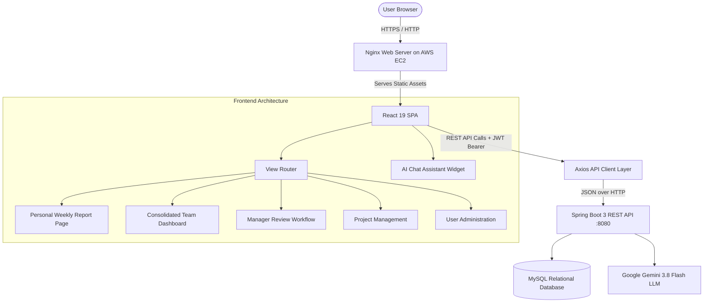

# 📊 Sisenco Weekly Report Generator & Consolidated Team Dashboard

[](https://react.dev/)
[](https://vitejs.dev/)
[](https://developer.mozilla.org/en-US/docs/Web/CSS)
[](https://github.com/features/actions)
[](https://aws.amazon.com/ec2/)
[](https://ai.google.dev/)

An enterprise-grade **Weekly Report Generator and Consolidated Team Dashboard** developed for Sisenco Engineering. Built with **React 19**, **Vite**, and a bespoke **Design System**, integrated with a Spring Boot 3 REST API deployed on AWS EC2.

The application automates weekly reporting workflows, personal draft saving, manager review/correction cycles, team compliance analytics, project tracking, user lifecycle management, and includes an intelligent **Google Gemini-powered AI Assistant**.

---

## 📑 Table of Contents
- [System Architecture](#-system-architecture)
- [Live Backend & Credentials](#-live-backend--credentials)
- [Key Features](#-key-features)
  - [1. Personal Weekly Report Management](#1-personal-weekly-report-management)
  - [2. Consolidated Team Dashboard](#2-consolidated-team-dashboard)
  - [3. Manager Review & Correction Workflow](#3-manager-review--correction-workflow)
  - [4. Project Lifecycle & Allocation](#4-project-lifecycle--allocation)
  - [5. User Administration & Instant Deactivation](#5-user-administration--instant-deactivation)
  - [6. AI Chat Assistant (Section 8)](#6-ai-chat-assistant-section-8)
- [Role-Based Access Control (RBAC)](#-role-based-access-control-rbac)
- [Project Structure](#-project-structure)
- [Local Development Setup](#-local-development-setup)
- [CI/CD & AWS Deployment](#-cicd--aws-deployment)
- [Security & Compliance](#-security--compliance)

---

## 🏛 System Architecture



---

## 🚀 Live Backend & Credentials

The application is connected to a production AWS EC2 instance:
- **API Base URL**: `http://52.66.241.245:8080`
- **Frontend Hosting**: AWS EC2 with Nginx reverse-proxy (`/var/www/weekly-report/`)

### 🔐 Seeded Demonstration Accounts
All accounts are active in the live EC2 database with universal password: **`Password@123`**

| Role | Name | Email | Focus / Responsibility |
| :--- | :--- | :--- | :--- |
| **System Administrator** | **Sachintha Nimesh** | `admin@sisenco.lk` | Full system governance, user deactivation, role assignments, project creation |
| **Engineering Lead** | **Nuwan Silva** | `nuwan.silva@sisenco.lk` | Team dashboard, report reviews, approvals, change requests, team workload monitoring |
| **Team Member** | **Chamara Fernando** | `chamara.f@sisenco.lk` | Senior Fullstack Engineer *(Commercial Bank Mobile App)* |
| **Team Member** | **Dilshan Jayawardena** | `dilshan.j@sisenco.lk` | Backend & Cloud Engineer *(e-Channelling Telemedicine)* |
| **Team Member** | **Kavindi Wickramasinghe** | `kavindi.w@sisenco.lk` | QA & Automation Specialist *(Commercial Bank App)* |
| **Team Member** | **Tharindu Rajapaksha** | `tharindu.r@sisenco.lk` | Frontend Engineer *(Dialog Axiata IoT)* |
| **Team Member** | **Anuki Senanayake** | `anuki.s@sisenco.lk` | UI & Mobile Apps Engineer *(SLT Fiber App)* |

---

## ✨ Key Features

### 1. Personal Weekly Report Management
- **Dynamic Weekly Cycle**: Automatically computes standard Monday-to-Sunday work weeks with intuitive week-picker navigation.
- **Granular Task Entries**: Add planned vs. actual tasks categorized by type:
  - `DEVELOPMENT` | `TESTING` | `MEETINGS` | `DOCUMENTATION` | `DEPLOYMENT`
- **Blockers & Achievements**: Dedicated fields for flagging critical blockers and celebrating milestone deliverables.
- **Auto-Save Drafts**: Save incomplete drafts (`DRAFT` status) and resume editing at any time.
- **Revision Resubmission**: Increment version history automatically when submitting revisions requested by management.

### 2. Consolidated Team Dashboard
- **Team Compliance Rate**: Live calculation of submitted vs. missing weekly reports for any given week.
- **Workload Distribution**: Visual hours breakdown across active projects and activity types.
- **Active Blockers Radar**: Immediate visibility into team members impeded by external blockers.
- **Status Cards**: Quick inspection of each member's report status (`APPROVED`, `SUBMITTED`, `NEEDS_CORRECTION`, `DRAFT`, `MISSING`).

### 3. Manager Review & Correction Workflow
- **Side-by-Side Review**: Inspect task-level progress, logged hours, blockers, and achievements.
- **1-Click Approval**: Instant status transition to `APPROVED` with auditor timestamps.
- **Change Request Cycle**: Return reports with inline feedback (`NEEDS_CORRECTION`), notifying the engineer to make corrections.

### 4. Project Lifecycle & Allocation
- **Enterprise Project Catalog**: Manage company-wide projects (Create, Update, Activate/Deactivate, Delete).
- **Engineer Assignment**: Assign team members to projects with focus areas and real-time workload tracking.

### 5. User Administration & Instant Deactivation
- **Account Status Enforcement**: Admins can toggle user accounts between `ACTIVE` and `INACTIVE`.
- **Instant Revocation**: If a user is deactivated while logged in:
  - Backend `JwtAuthenticationFilter` rejects any further action (HTTP 403 / 401).
  - Frontend `axiosClient` immediately intercepts the response, flushes the session, and redirects to login with an explicit alert.
- **Admin Self-Protection**: Safeguards prevent administrators from deactivating or demoting their own active accounts.

### 6. AI Chat Assistant (Section 8)
- **Google Gemini Model**: Powered by Google's `gemini-3.8-flash` LLM.
- **Context-Aware RAG Engine**: Generates executive summaries by querying live database entities (active projects, weekly reports, blockers, achievements).
- **Clean Markdown Renderer**: Custom markdown engine parses bold tokens (`**text**`), headings (`###`), bullet lists (`* `), and dividers (`---`) into formatted UI elements with zero raw asterisk clutter.
- **Dual-Engine Redundancy**: If external AI connectivity is unavailable, seamlessly falls back to the local Sisenco Reports Engine without throwing errors.
- **RBAC & Data Privacy**: As specified in Section 8, the assistant is **restricted to Managers and Admins only**, remaining hidden for standard team members to protect confidential team workload data.

---

## 🛡 Role-Based Access Control (RBAC)

| Capability / Route | `ROLE_ADMIN` | `ROLE_MANAGER` | `ROLE_TEAM_MEMBER` |
| :--- | :---: | :---: | :---: |
| Fill & Submit Personal Report | ✅ | ✅ | ✅ |
| View Personal Report History | ✅ | ✅ | ✅ |
| Consolidated Team Dashboard | ✅ | ✅ | ❌ |
| Review & Approve Team Reports | ✅ | ✅ | ❌ |
| Request Report Corrections | ✅ | ✅ | ❌ |
| AI Chat Assistant (Gemini) | ✅ | ✅ | ❌ |
| Project Catalog Management | ✅ | View Only | View Only |
| User Provisioning & Deactivation | ✅ | ❌ | ❌ |

---

## 📁 Project Structure

```
Weekly_Report_Dashboard_FrontEnd/
├── .github/
│   └── workflows/
│       └── deploy.yml             # GitHub Actions CI/CD to AWS EC2
├── public/                        # Static assets & brand icons
├── src/
│   ├── api/                       # Centralized Axios API services
│   │   ├── axiosClient.js         # JWT interceptor & auto-logout handler
│   │   ├── authApi.js             # Sign-in, sign-up, session profile
│   │   ├── reportApi.js           # Weekly report CRUD, approvals, reviews
│   │   ├── projectApi.js          # Project lifecycle management
│   │   ├── dashboardApi.js        # Aggregated team analytics & stats
│   │   ├── userApi.js             # User directory & deactivation API
│   │   └── aiApi.js               # Gemini AI Chat Assistant client
│   ├── components/                # Reusable UI component library
│   │   ├── AiChatWidget.jsx       # Floating Gemini Chatbot with markdown parser
│   │   ├── Navbar.jsx             # Navigation bar with role badges
│   │   ├── Badge.jsx              # Status & category pills
│   │   └── UserAvatar.jsx         # Sri Lankan identity avatars
│   ├── pages/                     # Application views & workflows
│   │   ├── auth/AuthPage.jsx                      # Sign-in & account creation
│   │   ├── reports/PersonalReportPage.jsx         # Report form with auto-save
│   │   ├── reports/ReportHistoryPage.jsx          # Personal submission log
│   │   ├── reports/ReportDetailPage.jsx           # Read-only report view
│   │   ├── manager/TeamDashboardPage.jsx          # Team compliance & metrics
│   │   ├── manager/ManagerReviewPage.jsx          # Review & approval interface
│   │   ├── manager/MemberProfilePage.jsx          # Member history inspection
│   │   ├── projects/ProjectsPage.jsx              # Enterprise project catalog
│   │   └── users/UserManagementPage.jsx           # User governance & status
│   ├── theme/
│   │   └── muiTheme.js            # MUI design token bridges
│   ├── utils/
│   │   └── dateUtils.js           # ISO week calculations (Monday–Sunday)
│   ├── App.jsx                    # Root view router & session guard
│   ├── index.css                  # Global CSS variables & typography
│   └── main.jsx                   # React 19 entry point
├── .env.example                   # Template environment variables
├── package.json                   # Dependencies & build scripts
└── vite.config.js                 # Vite build optimization configuration
```

---

## 🛠 Local Development Setup

### Prerequisites
- **Node.js**: `v18.0.0` or higher
- **npm**: `v9.0.0` or higher

### 1. Clone the Repository
```bash
git clone https://github.com/SachinthaNimesh370/Weekly_Report_Dashboard_Frontend.git
cd Weekly_Report_Dashboard_Frontend
```

### 2. Configure Environment
Create a `.env` file in the root directory:
```env
VITE_API_BASE_URL=http://52.66.241.245:8080
```

### 3. Install Dependencies
```bash
npm install
```

### 4. Start Local Development Server
```bash
npm run dev
```
Navigate to **`http://localhost:5173`** (or indicated port) in your browser.

### 5. Production Build
```bash
npm run build
```
Build output will be generated in `dist/`.

---

## 🚢 CI/CD & AWS Deployment

Every push to the **`main`** branch triggers an automated GitHub Actions pipeline ([`.github/workflows/deploy.yml`](.github/workflows/deploy.yml)):

1. **Build Step**:
   - Checks out repository on `ubuntu-latest`.
   - Sets up Node.js 20 with `npm` caching.
   - Injects `VITE_API_BASE_URL` secret.
   - Runs `npm ci` and `npm run build`.
2. **Deploy Step**:
   - Securely copies (`scp-action`) `dist/` bundle to EC2 target `/var/www/weekly-report/`.
   - Reloads Nginx via SSH (`sudo systemctl reload nginx`) with zero-downtime.

### Required GitHub Secrets
- `EC2_HOST`: Elastic IP / Public IP of EC2 frontend host.
- `EC2_SSH_KEY`: Private SSH RSA key (`.pem`) for `ubuntu` user.
- `VITE_API_URL`: Backend API URL (`http://52.66.241.245:8080`).

---

## 🔒 Security & Compliance

- **No Plaintext Secrets in Version Control**: `.gitignore` strictly ignores `.env`, `*.pem`, and sensitive local files.
- **Stateless JWT Authentication**: Tokens stored in localStorage and passed via `Authorization: Bearer <token>` headers.
- **Deactivation Interceptor**: Immediate logout and state purge upon receiving HTTP 401/403 due to account deactivation.
- **Data Privacy in AI Engine**: Prompt engineering sanitizes and provides only high-level summary contexts, avoiding leakage of personally identifiable credentials.
